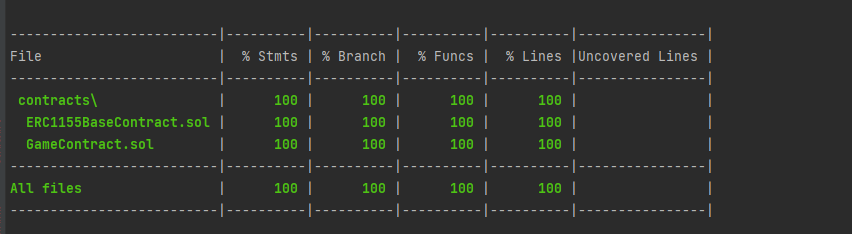

# Sample Hardhat Project

This project demonstrates a basic Hardhat use case. It comes with a sample contract, a test for that contract, and a script that deploys that contract.

Try running some of the following tasks:

```shell
npx hardhat help
npx hardhat test
GAS_REPORT=true npx hardhat test
npx hardhat node
npx hardhat run scripts/deploy.js

npx hardhat run scripts/deploy.js --network matic
npx hardhat verify --network matic 0xb702A91f95C045e1850AAF4B4bd2a8F1B163b359
npx hardhat verify --network matic 0x41d3cc91c36bb3a57387efc7a5a21c50952d9ffb "0xb702A91f95C045e1850AAF4B4bd2a8F1B163b359"
https://testnets.opensea.io/collection/unidentified-contract-k2r5kzesvo
https://mumbai.polygonscan.com/address/0xb702A91f95C045e1850AAF4B4bd2a8F1B163b359
https://mumbai.polygonscan.com/address/0x41d3cc91c36bb3a57387efc7a5a21c50952d9ffb

https://develop--dainty-travesseiro-413f2a.netlify.app
https://token-mint.herokuapp.com/
```


